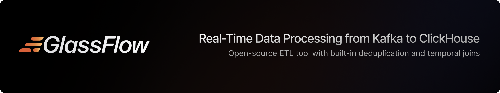

      <a href="https://docs.glassflow.dev"><strong>Docs</strong></a> ·     
      <a href="https://github.com/glassflow/clickhouse-etl/issues"><strong>Report Bug</strong></a> ·
      <a href="https://glassflow.dev/roadmap"><strong>Roadmap</strong></a> ·
      <a href="https://github.com/orgs/glassflow/discussions/categories/support"><strong>Get Help</strong></a> ·
      <a href="https://docs.glassflow.dev/getting-started#demo-video"><strong>Watch Demo</strong></a> ·
      <a href="https://docs.glassflow.dev/free-swag"><strong>Free Swag</strong></a>

 

  

# GlassFlow for ClickHouse Streaming ETL

GlassFlow is an open-source ETL tool that enables real-time data processing from Kafka to ClickHouse. GlassFlow pipelines can perform the following operations:

- **Deduplicate**: Remove duplicate records based on configurable keys and time windows - use when you need to ensure data uniqueness
- **Join**: Perform temporal joins between multiple Kafka topics - use when combining related data streams with time-based matching
- **Deduplicate & Join**: Combine both deduplication and joining in a single pipeline
- **Ingest only**: Direct data transfer from Kafka to ClickHouse without transformations

## ⚡️ Quick Start

To get started with GlassFlow, you can:

1. **Try the Live Demo**: Experience GlassFlow running on a live cluster at [demo.glassflow.dev](https://demo.glassflow.dev)
2. **Install on Kubernetes**: Follow our [Kubernetes Installation Guide](https://docs.glassflow.dev/installation/kubernetes) for production deployment
3. **Learn More**: Explore our [Usage Guide](https://docs.glassflow.dev/usage-guide) to start creating pipelines

## 🧭 Installation Options

GlassFlow is open source and can be self-hosted on Kubernetes. GlassFlow works with any managed Kubernetes services like AWS EKS, GKE, AKS, and more.

| Method                         | Use Case                                | Docs Link                                                                 |
|-------------------------------|------------------------------------------|---------------------------------------------------------------------------|
| ☸️ **Kubernetes with Helm**         | Production and development deployment    | [Kubernetes Helm Guide](https://docs.glassflow.dev/installation/kubernetes) |

## 🎥 Demo

### Live Preview
Log in and see a working demo of GlassFlow running on a GPC cluster at [demo.glassflow.dev](https://demo.glassflow.dev). You will see a Grafana dashboard and the setup that we used.

*GlassFlow Pipeline showing real-time streaming from Kafka through GlassFlow to ClickHouse*

### Demo Video

## 📚 Documentation

For detailed documentation, visit [docs.glassflow.dev](https://docs.glassflow.dev). The documentation includes:

- [Installation Guide](https://docs.glassflow.dev/installation)
- [Usage Guide](https://docs.glassflow.dev/usage-guide)
- [Pipeline JSON Reference](https://docs.glassflow.dev/configuration/pipeline-json-reference)
- [Live Preview](https://docs.glassflow.dev/getting-started/live-preview)
- [Architecture](https://docs.glassflow.dev/architecture)

## 🗺️ Roadmap

Check out our [public roadmap](https://glassflow.dev/roadmap) to see what's coming next in GlassFlow. We're actively working on new features and improvements based on community feedback.

**Want to suggest a feature?** We'd love to hear from you! Please use our [GitHub Discussions](https://github.com/orgs/glassflow/discussions/categories/ideas) to share your ideas and help shape the future of GlassFlow.

## 	✨ Features

- Streaming deduplication and joins for up to 7d through an inbuilt state store
- ClickHouse sink with a native protocol for high performance
- Built-in Kafka connector with SASL, SSL, etc. for nearly all Kafka providers
- Dead-Letter Queue for handling failed events
- Field mapping of your Kafka table to ClickHouse
- Prometheus metrics and OpenTelemetry logs for comprehensive observability

## 🆘 Support

- [Documentation](https://docs.glassflow.dev)
- [GitHub Issues](https://github.com/glassflow/clickhouse-etl/issues)
- [Slack Community](https://join.slack.com/t/glassflowhub/shared_invite/zt-349m7lenp-IFeKSGfQwpJfIiQ7oyFFKg)
- [Email Support](mailto:help@glassflow.dev)

## ⚖️ License

This project is licensed under the [Apache License 2.0](LICENSE).
