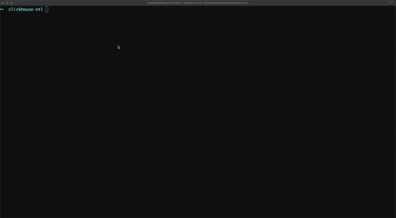

# GlassFlow ClickHouse ETL Demo

This demo showcases the capabilities of GlassFlow ClickHouse ETL using a local development environment. You can interact with the demo in two ways:

- **[Through the GlassFlow UI](#option-1-create-a-pipeline-using-the-glassflow-ui)**: Connect directly to the local Kafka and ClickHouse instances
- **[Through Python Scripts](#option-2-create-a-pipeline-using-python-demos)**: Use our Python SDK to automate the pipeline setup and generate events

> [!NOTE]
> **For Altinity ClickHouse Users**: If you're using Altinity ClickHouse instead of the local ClickHouse instance, check out the [instructions for running demos with Altinity](providers/altinity/README.md).


## Prerequisites

- Docker and Docker Compose
- Python 3.8+ (for Python demos)
- pip (Python package manager)

## Setup

Start the local infrastructure:

```bash
docker compose up -d
```

This will start:
- Kafka (ports 9092, 9093)
- ClickHouse (ports 8123, 9000)
- GlassFlow ClickHouse ETL application (port 8080)

## (Option 1) Create a Pipeline Using the GlassFlow UI

Once the GlassFlow application is running, the web interface will be available at http://localhost:8080. 
You can create a new pipeline and connect it to the local Kafka and ClickHouse instances.

In order to create a pipeline, you'll need the following:

### 1. Create the Kafka Topics

```bash
# Create a new Kafka topic
docker compose exec kafka kafka-topics \
    --topic users \
    --create \
    --partitions 1 \
    --replication-factor 1 \
    --bootstrap-server localhost:9092
```

and send a smaple event:
```bash
# Send sample JSON events to Kafka
echo '{"event_id": "123", "user_id": "456", "name": "John Doe", "email": "john@example.com", "created_at": "2024-03-20T10:00:00Z"}' | \
docker compose exec -T kafka kafka-console-producer \
    --topic users \
    --bootstrap-server localhost:9092
```

### 2. Create ClickHouse Table

```bash
docker compose exec clickhouse clickhouse-client \
    --user default \
    --password secret \
    --query "
CREATE TABLE IF NOT EXISTS users_dedup (
    event_id Int32,
    user_id Int32,
    name String,
    email String,
    created_at DateTime
) ENGINE = MergeTree 
ORDER BY event_id"
```

### 3. Create GlassFlow Pipeline through the UI

Go to http://localhost:8080 and follow the steps to create a pipeline. 

- Kafka Connection Details
```yaml
Authentication Method: No Authentication
Security Protocol: PLAINTEXT
Bootstrap Servers: kafka:9093
```

- ClickHouse Connection Details
```yaml
Host: clickhouse
HTTP/S Port: 8123
Native Port: 9000
Username: default
Password: secret
Use SSL: false
Database: default
```

### 4. Generate and send events to Kafka

```bash
# Send multiple JSON events to Kafka
echo '{"event_id": "123", "user_id": "456", "name": "John Doe", "email": "john@example.com", "created_at": "2024-03-20T10:00:00Z"}
{"event_id": "123", "user_id": "456", "name": "John Doe", "email": "john@example.com", "created_at": "2024-03-20T10:01:00Z"}
{"event_id": "124", "user_id": "457", "name": "Jane Smith", "email": "jane@example.com", "created_at": "2024-03-20T10:03:00Z"}' | \
docker compose exec -T kafka kafka-console-producer \
    --topic users \
    --bootstrap-server localhost:9092
```

### 5. See results on ClickHouse

```bash
docker compose exec clickhouse clickhouse-client \
    --user default \
    --password secret \
     -f prettycompact \
    --query "SELECT * FROM users_dedup"
```

## (Option 2) Create a Pipeline Using Python Demos

The Python demos automate the entire process, including:
- Creating Kafka topics
- Setting up ClickHouse tables
- Creating and configuring pipelines
- Generating and sending test events



### Setup Python Environment

1. Create and activate a virtual environment:

```bash
# Create virtual environment
python -m venv venv

# Activate virtual environment
# On macOS/Linux:
source venv/bin/activate
# On Windows:
# .\venv\Scripts\activate
```

2. Install Python dependencies:

```bash
pip install -r requirements.txt
```

### Available Demos

#### Deduplication Demo

Demonstrates how to deduplicate events using GlassFlow's deduplication capabilities:

```bash
# Run with default options
python demo_deduplication.py

# Run 100k examples with 50% duplicates
python demo_deduplication.py \
   --num_records 100000 \
   --duplication-rate 0.5
```

Options:
- `--num-records`: Number of records to generate (default: 10000)
- `--duplication-rate`: Rate of duplication (default: 0.1)
- `--rps`: Records per second (default: 1000)
- `--config`: Path to pipeline configuration file (default: config/glassflow/deduplication_pipeline.json)
- `--generator-schema`: Path to generator schema file (default: config/glassgen/user_event.json)
- `--print-n-rows` or `-p`: Number of rows to print from the results (default: 5)
- `--yes` or `-y`: Skip confirmation prompts
- `--cleanup` or `-c`: Cleanup ClickHouse table before running the pipeline

#### Join Demo

Demonstrates how to join data from two different Kafka topics using GlassFlow's temporal join capabilities:

```bash
# Run with default options
python demo_join.py

# Run with 100k events on the left and 1k events on the right and print the last 100 rows in the CH table
python demo_join.py \
   --left-num-records 100000 \
   --right-num-records 1000 \
   -p 100
```

Options:
- `--left-num-records`: Number of records to generate for left events (default: 10000)
- `--right-num-records`: Number of records to generate for right events (default: 10000)
- `--rps`: Records per second (default: 1000)
- `--config`: Path to pipeline configuration file (default: config/glassflow/join_pipeline.json)
- `--left-schema`: Path to left events generator schema file (default: config/glassgen/order_event.json)
- `--right-schema`: Path to right events generator schema file (default: config/glassgen/user_event.json)
- `--print-n-rows` or `-p`: Number of rows to print from the results (default: 5)
- `--yes` or `-y`: Skip confirmation prompts
- `--cleanup` or `-c`: Cleanup ClickHouse table before running the pipeline

### Configuration Files

The Python demos use several configuration files located in the `config` directory:

1. **Pipeline Configurations** (`config/glassflow/`):
   - `deduplication_pipeline.json`: Configuration for the deduplication pipeline
   - `join_pipeline.json`: Configuration for the join pipeline

2. **Generator Schemas** (`config/glassgen/`):
   - `user_event.json`: Schema for user events
   - `order_event.json`: Schema for order events

## Troubleshooting

1. **Infrastructure Issues**:
   - Check Docker logs:
     ```bash
     docker compose logs
     ```

2. **Pipeline Creation Issues**:
   - Ensure GlassFlow is running:
     ```bash
     docker compose up
     ```
   - Check pipeline status in the web interface (http://localhost:8080)

3. **Data Generation Issues**:
   - Verify Kafka topics:
     ```bash
     docker compose exec kafka kafka-topics --list --bootstrap-server localhost:9092
     ```
   - Check ClickHouse table:
     ```bash
     docker compose exec clickhouse clickhouse-client --user default --password secret --query "SELECT count() FROM <table_name>"
     ```

## Cleanup

To stop and remove all containers:
```bash
docker compose down
```

To remove all data (including volumes):
```bash
docker compose down -v
```

## Additional Resources

- [GlassGen Documentation](https://github.com/glassflow/glassgen)
- [GlassFlow ClickHouse ETL Python SDK](https://github.com/glassflow/clickhouse-etl-py-sdk)
- [Kafka Documentation](https://kafka.apache.org/documentation/)
- [ClickHouse Documentation](https://clickhouse.com/docs/en/) 