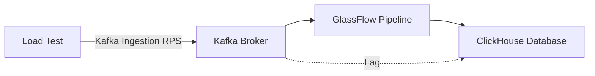
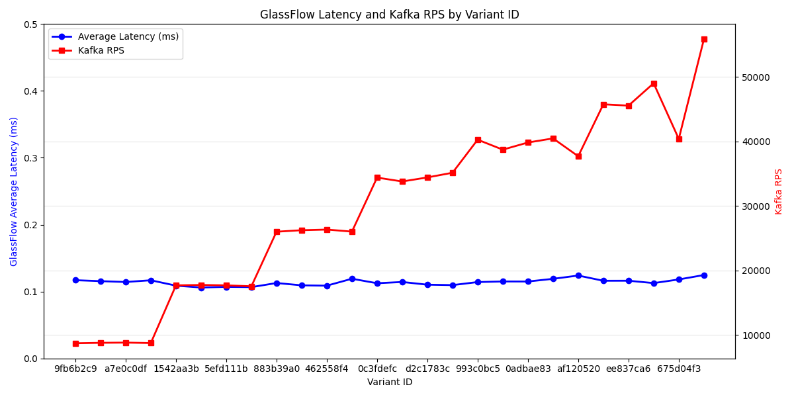
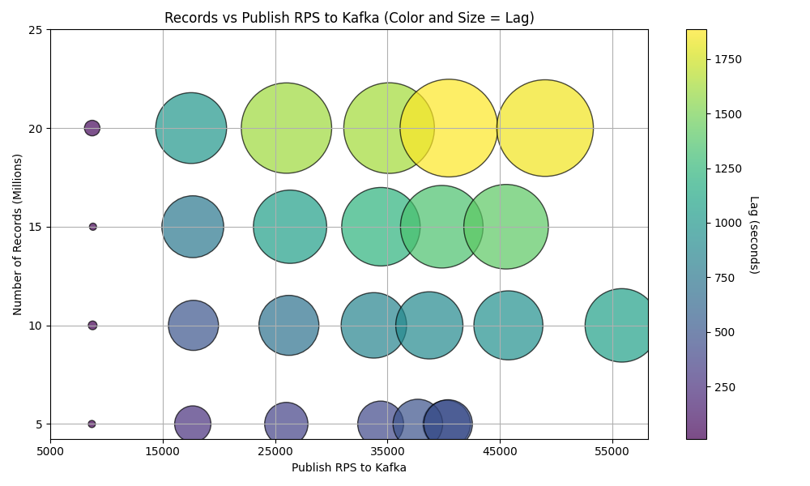

# Load Test Results

> Last Updated: May 22, 2025

## Overview
This document presents the results from a load testing run of the ETL pipeline with GlassFlow. 
The test was conducted to evaluate the performance and reliability of the system under various configurations.

## Test Data
The complete test results are available in the [etl-clickhouse-loadtest](https://github.com/glassflow/clickhouse-etl-loadtest) repository. The results include detailed metrics for each test variant, including throughput, latency, and processing times.

### Test Data Format
The tests were conducted using user event data with the following JSON structure:
```json
{
    "event_id": "$uuid4",
    "user_id": "$uuid4",
    "name": "$name",
    "email": "$email",
    "created_at": "$datetime(%Y-%m-%d %H:%M:%S)"
}
```

### Test Scope
These load tests focused specifically on the deduplication functionality of GlassFlow. The tests did not include temporal joins. Each test run:
- Generated events with the above schema
- Applied deduplication based on event_id
- Measured performance metrics for the deduplication process

## Discussion
We encourage discussion and feedback on these results. Please join the conversation in our [GitHub Discussions](https://github.com/orgs/glassflow/discussions) where you can:
- Share your observations
- Ask questions about the test methodology
- Discuss potential optimizations
- Compare results with your own testing

## Test results


### GlassFlow Pipeline Parameters

| Parameter | Value |
|-----------|-------|
| Duplication Rate | 0.1 |
| Deduplication Window | 8h |
| Max Delay Time | 10s |
| Max Batch Size (GlassFlow Sink - Clickhouse) | 5000 |

### Test Results

| Variant ID | Number of records (millions) | Ingestion RPS (Kafka) | GlassFlow RPS | Average Latency (ms) | Lag (sec) |
| --- | --- | --- | --- | --- | --- |
| load_9fb6b2c9 | 5.0 | 8705 | 8547 | 0.117 | 10.1 |
| load_0b8b8a70 | 10.0 | 8773 | 8653 | 0.1156 | 15.04 |
| load_a7e0c0df | 15.0 | 8804 | 8748 | 0.1143 | 10.04 |
| load_bd0fdf39 | 20.0 | 8737 | 8556 | 0.1169 | 47.74 |
| load_1542aa3b | 5.0 | 17679 | 9189 | 0.1088 | 260.55 |
| load_a85a4c42 | 10.0 | 17738 | 9429 | 0.1061 | 495.97 |
| load_5efd111b | 15.0 | 17679 | 9341 | 0.1071 | 756.49 |
| load_23da167d | 20.0 | 17534 | 9377 | 0.1066 | 991.77 |
| load_883b39a0 | 5.0 | 25995 | 8869 | 0.1128 | 370.57 |
| load_b083f89f | 10.0 | 26226 | 9148 | 0.1093 | 710.97 |
| load_462558f4 | 15.0 | 26328 | 9191 | 0.1088 | 1061.44 |
| load_254adf29 | 20.0 | 26010 | 8391 | 0.1192 | 1613.62 |
| load_0c3fdefc | 5.0 | 34384 | 8895 | 0.1124 | 415.78 |
| load_3942530b | 10.0 | 33779 | 8747 | 0.1143 | 846.26 |
| load_d2c1783c | 15.0 | 34409 | 9067 | 0.1103 | 1217.37 |
| load_febf151f | 20.0 | 35135 | 9121 | 0.1096 | 1622.75 |
| load_993c0bc5 | 5.0 | 40256 | 8757 | 0.1142 | 445.76 |
| load_022e44e5 | 10.0 | 38715 | 8687 | 0.1151 | 891.8 |
| load_0adbae83 | 15.0 | 39820 | 8694 | 0.115 | 1347.66 |
| load_77d67ac7 | 20.0 | 40458 | 8401 | 0.119 | 1885.24 |
| load_af120520 | 5.0 | 37691 | 8068 | 0.124 | 485.95 |
| load_c9424931 | 10.0 | 45743 | 8610 | 0.1161 | 941.66 |
| load_ee837ca6 | 15.0 | 45539 | 8605 | 0.1162 | 1412.48 |
| load_ac40b143 | 20.0 | 49005 | 8878 | 0.1126 | 1843.61 |
| load_675d04f3 | 5.0 | 40382 | 8467 | 0.1181 | 465.66 |
| load_28956d50 | 10.0 | 55829 | 8018 | 0.1247 | 1066.62 |


### Result parameters

| Parameter | Description |
|-----------|-------------|
| Variant ID | A unique identifier for each load test run with a specific set of parameters |
| Ingestion RPS | Rate of sending records to Kafka by the load testing framework (records per second) |
| GlassFlow RPS | The average rate of processing that GlassFlow achieved (records per second) |
| Average Latency | Average latency in milliseconds per record incurred by GlassFlow processing |
| Lag | The time difference (in seconds) between when the last record was sent to Kafka by the load testing framework and when that record became available in ClickHouse |

### Performance Graph






## Key Findings

### Stability
- The system was able to handle the load without any issues, even upto 55k RPS.
- The system was able to deduplicate the data without any issues

### Lag
- Lag was directly proportional to the RPS and the amount of data sent at the given RPS. 
- For a given RPS, lag was increasing with the amount of data sent (expected)

### Resource Utilization
- CPU utilization was efficient across all test variants
- Memory usage remained stable during extended test runs


## Next Steps

1. **Further Testing**
   - Longer duration tests
   - Higher throughput scenarios   
   - Tests with different events data

2. **Batch Size Optimization**
   - Testing with different batch sizes to compare performance and lag

3. **Monitoring Improvements**
   - Enhanced metrics collection 
   - Advanced analysis of the results

4. **Hardware setup**
    - Testing on different hardware 
    - Tests with remote clickhouse and kafka to check performance with network delay