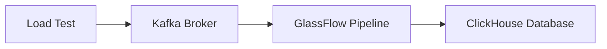

# Load Test Setup Guide

The complete load testing code is available in the [clickhouse-etl-loadtest](https://github.com/glassflow/clickhouse-etl-loadtest) repository.

## Test Environment

### Hardware Specifications
The load tests were conducted on a MacBook Pro with the following specifications:

| Specification | Details |
|---------------|---------|
| Model Name | MacBook Pro |
| Model Identifier | Mac14,5 |
| Model Number | MPHG3D/A |
| Chip | Apple M2 Max |
| Total Number of Cores | 12 (8 performance and 4 efficiency) |
| Memory | 32 GB |

### Software Stack
The test environment uses Docker containers for all components:
- **Kafka**: Message broker for event streaming
- **ClickHouse**: Database for storing and querying the processed events
- **GlassFlow**: Data pipeline tool for processing and transforming events

## Test Architecture

### Component Overview


### Test Flow
1. Each test run:
   - Creates a new GlassFlow pipeline
   - Configures the pipeline with test parameters
   - Sends test data to Kafka
   - Monitors the data flow through the pipeline
   - Verifies results in ClickHouse
   - Reports metrics for the run

2. Success Criteria:
   - Test is considered successful when all expected data is available in ClickHouse
   - Metrics are collected and reported for each run

## Performance Considerations

### Kafka Ingestion Rate (Records Per Second)
- The tool attempts to achieve the requested RPS
- The parameter controlling the Kafka ingestion rate is `num_processes`
- The actual achieved RPS may vary based on:
  - System resources
  - Network conditions
  - Pipeline configuration
- The results table shows the actual RPS achieved for each run

### Lag Measurement
- Lag is defined as the time difference between:
  - When the last event is sent to Kafka
  - When that event becomes available in ClickHouse
- Lag is influenced by:
  - Target RPS
  - Total number of events
  - Pipeline configuration
  - System performance

### GlassFlow Processing RPS (Records Per Second)
- The results shows the average RPS processed by GlassFlow

## Configuration Parameters

### Test Parameters

The load test can be configured using the following parameters in `load_test_params.json`:

| Parameter | Required/Optional | Description | Example Range/Values | Default
|-----------|------------------|-------------|--------------|--------------|
| num_processes | Required | Number of parallel processes | 1-N (step: 1) | - |
| total_records | Required | Total number of records to generate | 500,000-5,000,000 (step: 500,000) | -
| duplication_rate | Optional | Rate of duplicate records | 0.1 (10% duplicates) | 0.1 | 
| deduplication_window | Optional | Time window for deduplication | ["1h", "4h"] | "8h" |
| max_batch_size | Optional | Max batch size for the sink | [5000] | 5000 |
| max_delay_time | Optional | Max delay time for the sink | ["10s"] | "10s" |

#### Example Configuration
Example configuration:
```json
    {
    "parameters": {
        "num_processes": {
            "min": 1,
            "max": 4,
            "step": 1,
            "description": "Number of parallel processes to run"
        },        
        "total_records": {
            "min": 5000000,
            "max": 10000000,
            "step": 5000000,
            "description": "Total number of records to generate"
        }
    },    
    "max_combinations": 1
}
```

### ClickHouse Sink Parameters
These parameters affect the performance of the ClickHouse sink component in GlassFlow:

1. **Batch Size**
   - Controls how many records are processed in a single batch
   - Higher batch sizes generally provide better performance under high load
   - Should be configured based on:
     - Expected load
     - Available memory
     - Latency requirements

2. **Delay Time**
   - Maximum time to wait before processing a batch
   - Affects the balance between latency and throughput
   - Should be tuned based on:
     - Real-time processing requirements
     - System resources
     - Expected load patterns

## Running the Tests

### Prerequisites
1. Docker installed and running
2. Python 3.x installed
3. Required Python packages installed

### Test Execution
```bash
# Run a load test with specific configuration
python main.py --test-id load_test_1 --config load_test_params.json

# Analyze the results
python results.py --results-file results/load_test_1.csv
```


### Test Results File Format

The following metrics are collected and displayed for each test run:


| Metric | Description | Unit |
|--------|-------------|------|
| duration_sec | Total time taken for the test | seconds |
| result_num_records | Number of records processed | count |
| result_time_taken_publish_ms | Time taken to publish records to Kafka | milliseconds |
| result_time_taken_ms | Time taken to process records through the pipeline | milliseconds |
| result_kafka_ingestion_rps | Records per second sent to Kafka | records/second |
| result_avg_latency_ms | Average latency per record | milliseconds |
| result_success | Whether the test completed successfully | boolean |
| result_lag_ms | Lag between data generation and processing | milliseconds |
| result_glassflow_rps | Records per second processed by GlassFlow | records/second |

#### Example Results
```
 {                                                                             
   "Parameters": {                                                            
     "Variant ID": "load_bd0fdf39",                                           
     "Max Batch Size": 5000,                                                  
     "Duplication Rate": 0.1,                                                 
     "Deduplication Window": "8h",                                            
     "Max Delay Time": "10s"                                                  
   },                                                                         
   "Results": {                                                               
     "Success": "True",                                                       
     "Number of Records": "20.0M",                                            
     "Time to Publish": "2289.22 s",                                          
     "Source RPS in Kafka": "8737 records/s",                                 
     "GlassFlow RPS": "8556 records/s",                                       
     "Time to Process": "2337.666 s",                                         
     "Average Latency": "0.0001 s",                                           
     "Lag": "47.738 s"                                                        
   }                                                                          
 }
```


## Best Practices

1. **Resource Management**
   - Monitor Docker container resource usage
   - Ensure sufficient memory allocation
   - Watch for container limits

2. **Test Planning**
   - Start with conservative parameters
   - Gradually increase load
   - Monitor system resources
   - Document all parameter changes

3. **Data Verification**
   - Verify data consistency in ClickHouse
   - Check for any data loss
   - Validate processing order when required 