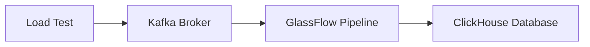

# Load Test Setup Guide

## Test Environment

### Hardware Specifications
The load tests were conducted on a MacBook Pro with the following specifications:

| Specification | Details |
|---------------|---------|
| Model Name | MacBook Pro |
| Model Identifier | Mac14,5 |
| Model Number | MPHG3D/A |
| Chip | Apple M2 Max |
| Total Number of Cores | 12 (8 performance and 4 efficiency) |
| Memory | 32 GB |

### Software Stack
The test environment uses Docker containers for all components:
- **Kafka**: Message broker for event streaming
- **ClickHouse**: Database for storing and querying the processed events
- **GlassFlow**: Data pipeline tool for processing and transforming events

## Test Architecture

### Component Overview


### Test Flow
1. Each test run:
   - Creates a new GlassFlow pipeline
   - Configures the pipeline with test parameters
   - Sends test data to Kafka
   - Monitors the data flow through the pipeline
   - Verifies results in ClickHouse
   - Reports metrics for the run

2. Success Criteria:
   - Test is considered successful when all expected data is available in ClickHouse
   - Metrics are collected and reported for each run

## Performance Considerations

### RPS (Records Per Second)
- The tool attempts to achieve the requested RPS
- Actual achieved RPS may vary based on:
  - System resources
  - Network conditions
  - Pipeline configuration
- The results table shows the actual RPS achieved for each run

### Lag Measurement
- Lag is defined as the time difference between:
  - When the last event is sent to Kafka
  - When that event becomes available in ClickHouse
- Lag is influenced by:
  - Target RPS
  - Total number of events
  - Pipeline configuration
  - System performance

## Configuration Parameters

### Test Parameters

The load test can be configured using the following parameters in `load_test_params.json`:

| Parameter | Description | Range/Values |
|-----------|-------------|--------------|
| num_processes | Number of parallel processes | 4-12 (step: 2) |
| records_per_second | Records per second to generate | 10,000-50,000 (step: 10,000) |
| total_records | Total number of records to generate | 500,000-5,000,000 (step: 500,000) |
| param_duplication_rate | Rate of duplicate records | 0.1 (10% duplicates) |
| param_deduplication_window | Time window for deduplication | ["1h", "4h"] |
| param_max_batch_size | Max batch size for the sink | [5000] |
| param_max_delay_time | Max delay time for the sink | ["10s"] |

#### Example Configuration
```json
{
    "num_processes": 8,
    "records_per_second": 30000,
    "total_records": 2000000,
    "param_duplication_rate": 0.1,
    "param_deduplication_window": "4h",
    "param_max_batch_size": 5000,
    "param_max_delay_time": "10s"
}
```

### ClickHouse Sink Parameters
These parameters affect the performance of the ClickHouse sink component in GlassFlow:

1. **Batch Size**
   - Controls how many records are processed in a single batch
   - Higher batch sizes generally provide better performance under high load
   - Should be configured based on:
     - Expected load
     - Available memory
     - Latency requirements

2. **Delay Time**
   - Maximum time to wait before processing a batch
   - Affects the balance between latency and throughput
   - Should be tuned based on:
     - Real-time processing requirements
     - System resources
     - Expected load patterns

## Running the Tests

### Prerequisites
1. Docker installed and running
2. Python 3.x installed
3. Required Python packages installed

### Test Execution
```bash
# Run a load test with specific configuration
python main.py --test-id load_test_1 --config load_test_params.json

# Analyze the results
python results.py --results-file results/load_test_1.csv
```


### Test Results File Format

The following metrics are collected and displayed for each test run:

| Metric | Description | Unit | Notes |
|--------|-------------|------|-------|
| duration_sec | Total time taken for the test | seconds | Includes warmup period |
| result_num_records | Total number of records processed | records | Total count of processed records |
| result_time_taken_publish_ms | Time taken to publish records to Kafka | milliseconds | Publishing time to Kafka |
| result_rps_achieved | Actual records per second achieved | records/sec | Actual throughput achieved |
| result_time_taken_ms | Total processing time | milliseconds | Total time for processing |
| result_avg_latency_ms | Average processing time per record | milliseconds | End-to-end latency per record |
| result_lag_ms | Time between last Kafka message and ClickHouse availability | milliseconds | Processing delay |
| result_success | Test completion status | boolean | ✅ for success, ❌ for failure |

#### Example Results
```
Variant ID: load_bd0fdf39

Parameters:
- Number of Processes: 2
- Records per Second (requested): 200000
- Total Records: 20000000
- Duplication Rate: 0.1
- Deduplication Window: 8h
- Max Batch Size: 5000
- Max Delay Time: 10s

Results:
- Test Duration: 2348.01
- Records Processed: 20.0M
- RPS Achieved: 8737
- Average Latency: 0.0s
- Lag: 47.74s
- Status: 1
```


## Best Practices

1. **Resource Management**
   - Monitor Docker container resource usage
   - Ensure sufficient memory allocation
   - Watch for container limits

2. **Test Planning**
   - Start with conservative parameters
   - Gradually increase load
   - Monitor system resources
   - Document all parameter changes

3. **Data Verification**
   - Verify data consistency in ClickHouse
   - Check for any data loss
   - Validate processing order when required 